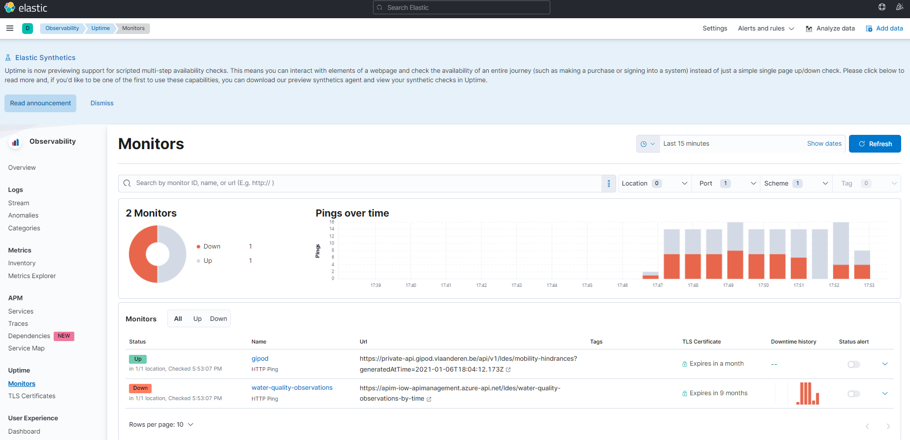

# LDES Dashboard

## Description
A poc for using elastic to monitor the health of a ldes server.
Endpoints:

    - https://apim-iow-apimanagement.azure-api.net/ldes/water-quality-observations-by-time
    - https://private-api.gipod.vlaanderen.be/api/v1/ldes/mobility-hindrances?generatedAtTime=2021-01-06T18:04:12.173Z

are under monitoring by heartbeat. 

## how to run
```
docker compose up
```
under project directory.

- docker-compose.yml is a docker-compose file that will start kibana, heartbeat and elastic instance.
- ./heartbeat/heartbeat.yml is the heartbeat config file.

## how to use

1. Go to localhost:5601 to see the kibana dashboard. 
2. http://localhost:5601/app/uptime to see the uptime dashboard.
    

